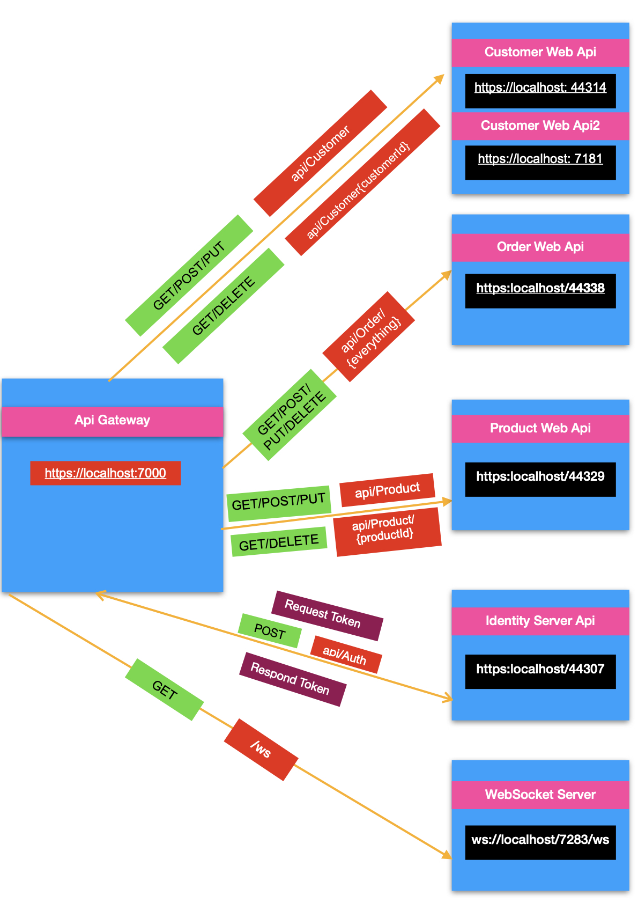

# Ocelot Gateway Microservices

This project demonstrates a microservices architecture using the **Ocelot API Gateway** in .NET Core with comprehensive support for routing, authentication, authorization, load balancing, secure communication over HTTPS, and WebSocket handling. The API Gateway serves as a centralized entry point, streamlining management and security for various microservices within the system.

## Overview

The **Ocelot Gateway Microservices** project showcases how to utilize Ocelot as an API gateway to manage a suite of microservices effectively. With features like JWT-based authentication, role-based authorization, HTTPS routing, and WebSocket support, this setup provides a robust foundation for secure, scalable microservices architectures.

## Features

- **API Gateway Routing**: Efficient routing of HTTP and WebSocket requests over HTTPS and WSS.
- **Authentication & Authorization**: JWT Bearer token authentication and role-based authorization for fine-grained access control.
- **Load Balancing**: Configurable load balancing to distribute requests across multiple service instances.
- **Rate Limiting**: Controls to manage request rates and prevent abuse of the gateway.
- **WebSocket Support**: Handles WebSocket connections for real-time data flow between clients and services.

## Project Structure

- **ApiGateway**: Contains the Ocelot configuration and middleware setup for secure, authorized access.
- **Microservices**:
  - **IdentityServerApi**: Handles user authentication and JWT token generation.
  - **ProductWebApi**: Manages product-related data.
  - **CustomerWebApi & CustomerWebApi2**: Handles customer data and operations.
  - **OrderWebApi**: Manages order-related functionalities.
- **WebSocket Components**:
  - **WebSocketsChatApp**: Client-facing WebSocket application for real-time chat features.
   - **WebSocket.Server**: Manages server-side WebSocket connections and real-time communication logic.

## Architecture



This architecture diagram showcases how the **ApiGateway** routes requests to the appropriate microservices, managing both HTTP and WebSocket requests securely over HTTPS.

## Getting Started

### Prerequisites

1. **.NET Core 6 .
2. **Visual Studio 2022** .

### Installation

#### Step 1: Clone the repository

```bash
git clone https://github.com/merveozan/Ocelot-Gateway-Microservices.git
cd Ocelot-Gateway-Microservices
```

#### Step 2: Configure Ocelot Gateway

- Open the `ocelot.json` file located in the **ApiGateway** project.
- Ensure that the `DownstreamPathTemplate`, `DownstreamScheme`, `DownstreamHostAndPorts`, and `UpstreamPathTemplate` fields match your microservices' URLs and HTTPS paths.
- If your services are running on different ports, adjust the ports in `ocelot.json` accordingly.

> **Tip:** Double-check that your configurations are accurate to avoid `502 Bad Gateway` errors.

#### Step 3: Run the Solution

1. Open the project in **Visual Studio 2022**.
2. Start each microservice project (e.g., **IdentityServerApi**, **ProductWebApi**, **CustomerWebApi**, **OrderWebApi**), ensuring each one starts without errors.
3. Start the **ApiGateway** project last to make sure it can route to all the microservices.


#### Step 4: Testing the Setup

1. **Use Postman** to test endpoints defined in `ocelot.json`.
2. Ensure HTTPS is enabled, and use a valid JWT token for requests requiring authorization.
3. Test various endpoints like:

   - **Product API**: `https://localhost:7000/api/Product`
   - **Customer API**: `https://localhost:7000/api/Customer`
   - **Order API**: `https://localhost:7000/api/Order`

## Troubleshooting

1. **502 Bad Gateway**:
   - Ensure all microservices are running.
   - Verify `ocelot.json` for correct paths, schemes, and ports.
   - Check firewall settings and make sure ports are open.

2. **401 Unauthorized**:
   - Make sure JWT tokens are correctly configured and valid.
   - Verify that the token has necessary claims and roles for the endpoint.

